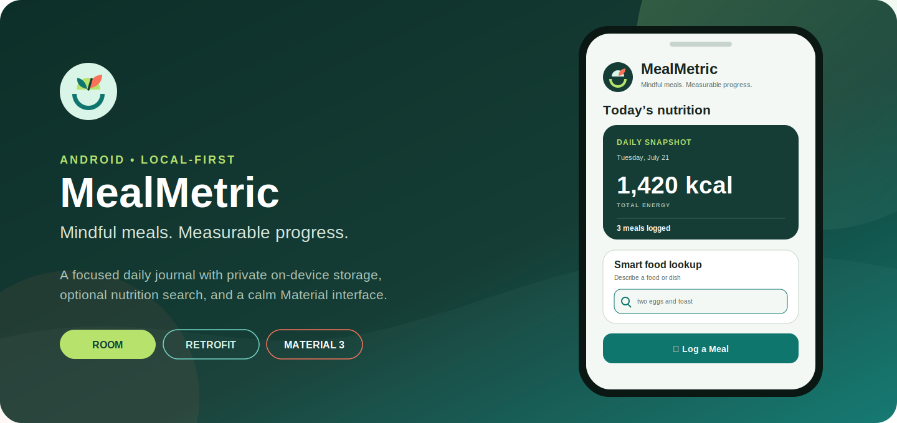
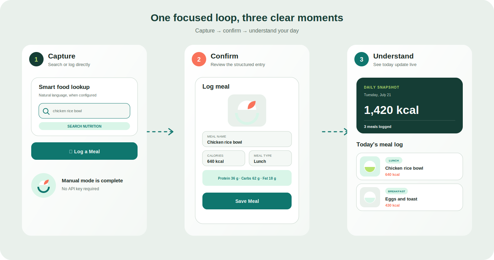
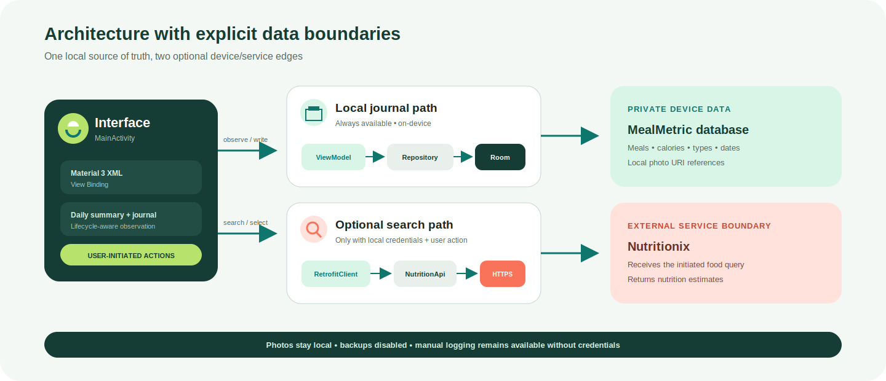

<p align="center">
  
</p>

<p align="center">
  <a href="https://github.com/Himath2002/mealmetric-android/actions/workflows/android-ci.yml"></a>
  
  
  <a href="LICENSE"></a>
</p>

<p align="center">
  <strong>Mindful meals. Measurable progress.</strong><br>
  A focused Android journal for logging meals, understanding daily energy intake, and optionally turning natural-language food searches into structured entries.
</p>

---

## Why MealMetric

Meal tracking should remain useful when an API is unavailable and private when a cloud account is unnecessary. MealMetric is designed around that principle: manual logging and the daily journal work locally, while Nutritionix search is a clearly separated, optional enhancement.

The project demonstrates a production-minded Android foundation without hiding its scope. It is a compact single-screen application, not a clinical nutrition tool or a cross-device service.

### Product highlights

- **Fast daily capture** — record a meal name, calories, type, and optional local photo.
- **Live daily snapshot** — observe total energy and meal count as the journal changes.
- **Natural-language lookup** — search descriptions such as “two eggs and toast” when Nutritionix is configured.
- **Local-first storage** — Room persists meal records on the device; selected images remain content URIs.
- **Graceful optional integration** — the app compiles and manual logging works without API credentials.
- **Purpose-built interface** — custom MealMetric palette, iconography, empty state, light theme, and dark theme.

## Product walkthrough

<p align="center">
  
</p>

> The panels above are original interface illustrations derived from the implemented Android views. They describe real flows; they are not presented as device screenshots.

### Inputs and outcomes

| Flow | Input | Outcome |
| --- | --- | --- |
| Manual log | Name, calorie amount, meal type, optional photo | A dated Room record, an updated meal list, total calories, and meal count |
| Nutrition lookup | Natural-language food description | Nutritionix candidates that can prefill calories and a macro summary |
| Photo selection | An image chosen through Android’s document picker | Persisted read access to a local content URI; no image upload |
| Daily journal | Current calendar date | A newest-first observable list scoped to that date |

## Architecture

<p align="center">
  
</p>

The UI observes date-scoped `LiveData` from `MealViewModel`. Writes move through `MealRepository` onto a dedicated database executor, while Room remains the single source of truth. Nutrition lookup is isolated behind `NutritionClient` and `NutritionApi`, and only runs when local credentials are present.

```text
MainActivity + View Binding
├── MealViewModel
│   └── MealRepository
│       └── Room: MealDatabase → MealDao → meals
├── NutritionClient → NutritionApi → Nutritionix (optional)
└── Android OpenDocument → persisted local photo URI
```

### Code organization

| Package | Responsibility |
| --- | --- |
| `ui` | Activity orchestration and RecyclerView presentation |
| `viewmodel` | Lifecycle-aware journal state and UI-facing commands |
| `model` | Meal records and read-only nutrition estimates |
| `data/local` | Room database and DAO contracts |
| `data/repository` | The single persistence boundary used by the ViewModel |
| `data/remote` | Nutrition request/response mapping and Retrofit configuration |

### Technical decisions

| Concern | Approach |
| --- | --- |
| UI | Material 3 XML layouts with View Binding |
| State | Lifecycle-aware `LiveData` through `ViewModel` |
| Persistence | Room database with an exported versioned schema |
| Background work | Bounded database executor and asynchronous Retrofit calls |
| Networking | Retrofit 3, Gson converter, and OkHttp timeouts |
| Photos | Storage Access Framework; URI reference only |
| Secrets | Ignored `secrets.properties` or environment variables |
| Toolchain | Java 17 source compatibility, JDK 21 build runtime, Android API 36, Gradle wrapper, version catalog |

## Run locally

### Prerequisites

- Android Studio with Android SDK 36
- JDK 21
- An emulator or Android device running API 24+

### 1. Clone and open

```bash
git clone https://github.com/Himath2002/mealmetric-android.git
cd mealmetric-android
```

Open the directory in Android Studio and allow the Gradle sync to complete.

### 2. Build the app

```bash
./gradlew assembleDebug
```

The debug APK is generated at `app/build/outputs/apk/debug/app-debug.apk`.

### 3. Run

Select an API 24+ device in Android Studio, then run the `app` configuration. Manual meal logging is ready immediately—no service account or cloud project is required.

## Optional Nutritionix search

Nutrition search is the only feature that needs credentials. Keep credentials local:

```bash
cp secrets.properties.example secrets.properties
```

Then replace the placeholders in `secrets.properties`:

```properties
NUTRITIONIX_APP_ID=your_app_id
NUTRITIONIX_APP_KEY=your_app_key
```

You can alternatively provide environment variables with the same names. `secrets.properties`, `google-services.json`, keystores, and local SDK configuration are ignored by Git.

> Never commit real API credentials. If credentials are exposed, revoke them at the provider before removing them from source control.

## Useful commands

```bash
# Compile the debug application
./gradlew assembleDebug

# Run Android lint
./gradlew lint

# Reproduce the CI verification locally
./gradlew clean assembleDebug lint
```

The public build intentionally runs without Nutritionix secrets; that verifies the local-first path remains a complete, buildable experience.

## Project structure

```text
mealmetric-android/
├── .github/
│   ├── workflows/android-ci.yml       # Reproducible build and lint checks
│   └── dependabot.yml                 # Monthly dependency review
├── app/
│   ├── schemas/                       # Versioned Room schema history
│   ├── src/main/java/.../mealmetric/
│   │   ├── ui/                        # Activity and list presentation
│   │   ├── viewmodel/                 # Lifecycle-aware journal state
│   │   ├── model/                     # Local and remote-facing models
│   │   └── data/
│   │       ├── local/                 # Room database and DAO
│   │       ├── repository/            # Persistence boundary
│   │       └── remote/                # Nutritionix integration
│   ├── src/main/res/                   # Layouts, themes, strings, vectors
│   ├── build.gradle.kts
│   └── lint.xml                       # Stable-platform lint policy
├── docs/                              # Original README visuals
├── gradle/libs.versions.toml          # Central dependency versions
├── secrets.properties.example        # Safe configuration template
└── README.md
```

## Privacy and data boundaries

- Meal names, calories, types, dates, and photo references are stored in the local Room database.
- Photos are selected through Android’s system document picker and are not copied or uploaded by MealMetric.
- The manifest disables app-data backup and device transfer for journal data.
- A food query leaves the device only when Nutritionix credentials are configured and the user initiates a search.
- API keys are injected into the local build; they are not embedded in this repository.

Nutrition values returned by a third-party service are estimates. MealMetric does not provide medical advice.

## Quality baseline

The repository is kept intentionally small and reviewable. The release baseline includes:

- a successful clean debug build;
- Android lint with no reported issues;
- credential and generated-artifact exclusions;
- a committed Room schema for migration review;
- CI on pushes to `main` and pull requests;
- automated monthly Gradle and GitHub Actions dependency checks.

See [CONTRIBUTING.md](CONTRIBUTING.md) for the contribution workflow and [SECURITY.md](SECURITY.md) for responsible disclosure guidance.

## Scope and roadmap

MealMetric currently focuses on one reliable daily-journal loop. Natural next steps include edit/delete actions, user-defined energy goals, date navigation, macro persistence, accessibility testing on physical devices, and database migrations as the schema evolves.

## License

Released under the [MIT License](LICENSE).

---

<p align="center">
  Designed and engineered by <a href="https://github.com/Himath2002">Himath Ahangama</a>.
</p>
